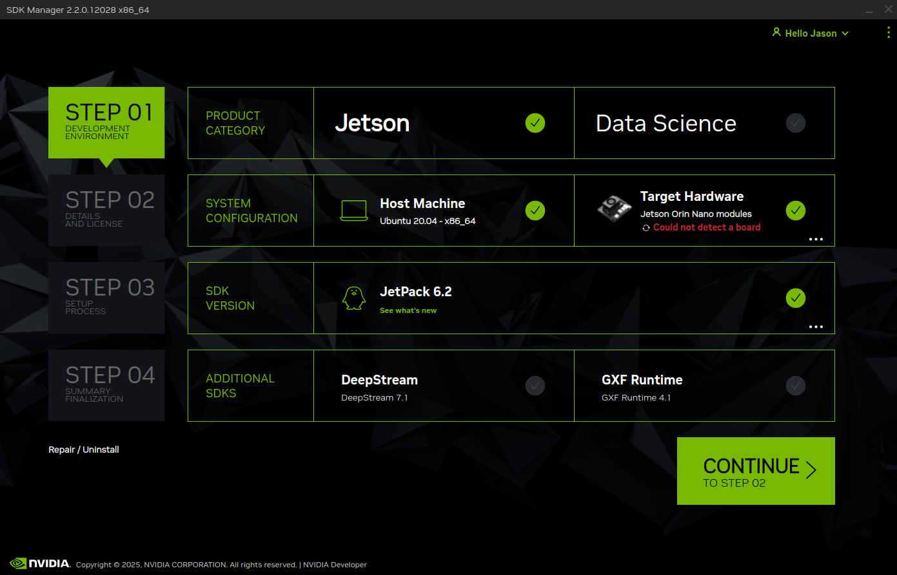
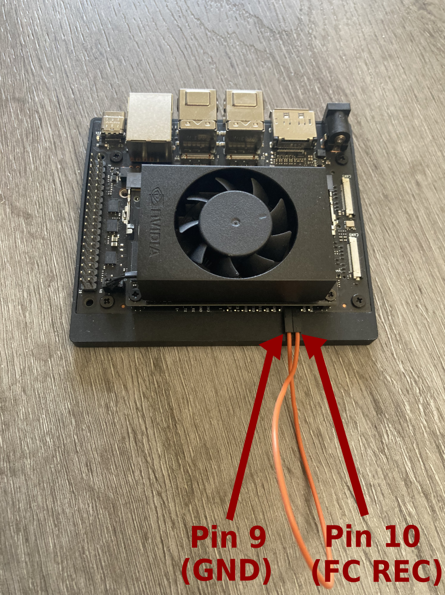
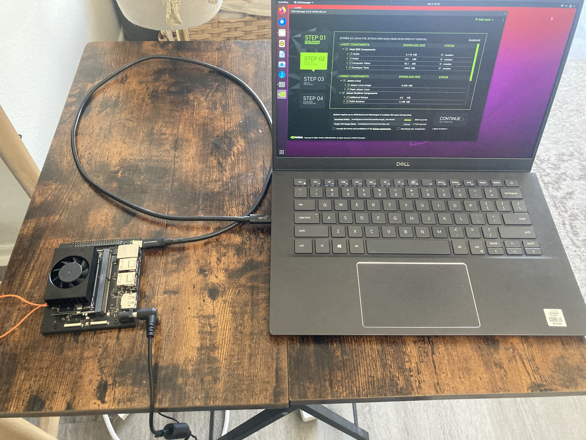
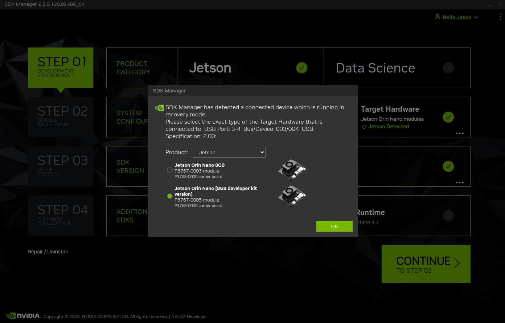
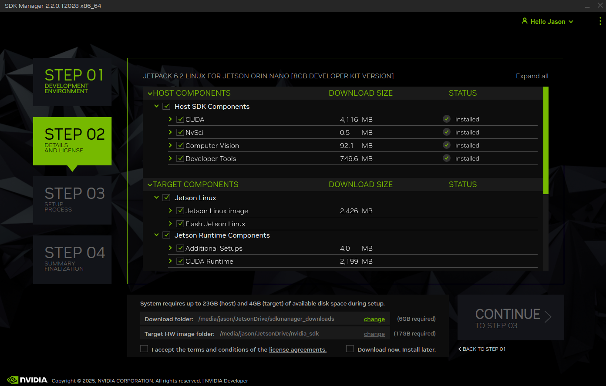
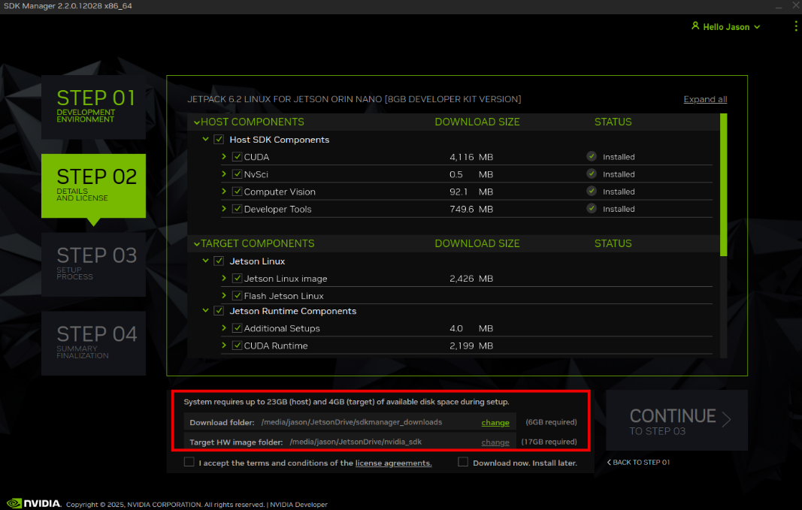
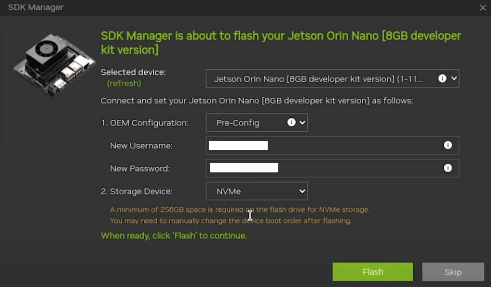
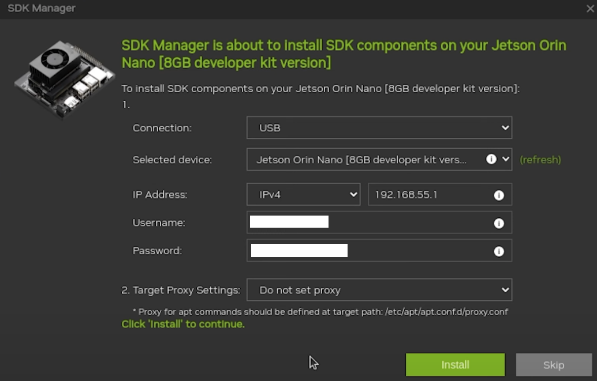

# Flashing the Jetson Orin Nano 8GB Developer Kit with JetPack 6.2 (Ubuntu 22.04)

This guide documents how to flash the **Jetson Orin Nano 8GB Developer Kit** with **JetPack 6.2** using **NVIDIA SDK Manager**, installing **Ubuntu 22.04** directly to a **512GB NVMe SSD**, and configuring the board for headless access over Wi-Fi.

## Tools Used

* **Host OS:** Ubuntu 20.04
* **Target Device:** Jetson Orin Nano 8GB Developer Kit
* **JetPack Version:** 6.2
* **Flashing Tool:** NVIDIA SDK Manager (v2.2.0)
* **Target Storage:** 512GB NVMe SSD
* **External Storage for Downloads:** High-speed USB 3.2 flash drive (~1000MB/s read/write)

## Flashing Steps

1. Download and install [SDK Manager](https://developer.nvidia.com/sdk-manager) from NVIDIA using the .deb package. Once installed, open SDK Manager and log into your NVIDIA Developer account to access JetPack options.

  

2. Connect the Jetson Orin Nano Dev Kit to the host machine using the following three connections:

* **Recovery Mode:** Bridge pins `9 (GND)` and `10 (FC REC)` with a wire to enter recovery mode.

  

* **USB Connection:** Connect the Jetson’s USB-C port to your host PC.

* **Power Supply:** Power up the Jetson.

  

3. Once connected, it should recognize your board:

  

Then select **Jetson Orin Nano [GB developer kit version]** 

4. You should now be at `Step 02` of NVIDIA SDK Manager. You should now select the components to be downloaded and installed onto both your host machine and your Jetson.

  

There are two sections:

* **Host SDK Components:** Installed on your development machine (CUDA, Nsight tools, Computer Vision SDK, etc.)

* **Target Components:** Downloaded to prepare the image that will be flashed onto your Jetson (Ubuntu image, CUDA runtime, libraries, etc.)

  

At the bottom of the SDK Manager interface, you are prompted to choose two folder locations:

* **`Download Folder`:** Where all JetPack component files are saved

* **`Target HW Image Folder`:** Where the root filesystem and flashable OS image is built before being deployed to your Jetson

To save space on my internal drive, I used an **external storage device** for both folders — but I initially chose a **regular USB SSD**, and SDK Manager **stalled at 0% during downloads** (as seen in the screenshot).

Turns out the drive or USB cable **couldn't handle the required read/write speeds**, which silently caused the process to hang.

**Solution: I switched to a high-speed USB 3.2 flash drive with ~1000MB/s read/write performance — and everything worked flawlessly from that point on.**

When using external drives with SDK Manager, make sure they support fast sustained I/O. Otherwise, downloads or flashing may freeze with no clear error.

5. Once the everything has downloaded you can go the `Step 03`:

  

You’ll be prompted to choose where to install the OS on the Jetson. In the `Storage Device` dropdown, make sure to select `NVMe` as the target. Also you can set up your username and password.

6. Still in `Step 03` you'll get:

  

Set up the default user and password during the pre-install step and choose the `USB` or `Ethernet` connection. No need to set proxy.

7. **Flash Ubuntu 22.04** to the 512GB NVMe.

**You have now flashed the Jetson Orin Nano 8GB Developer Kit with JetPack 6.2 (Ubuntu 22.04).**

## Headless Setup (Wi-Fi + SSH Access)

